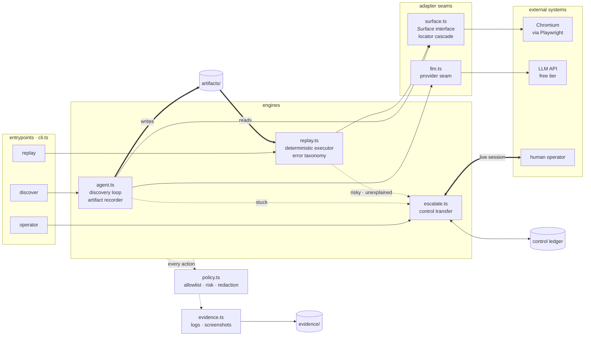

# Design write-up

## 1. Architecture

One TypeScript process. Two engines share one schema, one perception seam and
one guardrail layer; only discovery links against the model provider.

The load-bearing property is what is *absent*: `replay.ts` has no edge to
`llm.ts`. Determinism is enforced by the dependency graph, not by discipline —
the production path cannot reach a model even by mistake. Everything that
touches a UI goes through the single `Surface` interface, which is the seam a
desktop or screenshot-based implementation would slot into.

Key decisions:

- **Single process, no services.** The interesting problems (schema, locator
  robustness, error taxonomy, control transfer) are orthogonal to process
  topology; the seams are module boundaries, so a queue could sit between CLI
  and engines untouched. Premature infrastructure is an explicit non-goal.
- **Discovery executes through the replay locator path.** When the model picks
  an element, the recorder builds the ranked locator candidates and the action
  is executed by resolving *those candidates* — the same code replay uses. A
  recorded locator that wouldn't survive replay fails at record time, not in
  production. The highest-leverage integration decision here.
- **The LLM sees an observation digest, not raw HTML**: visible text per frame
  plus a numbered list of interactive elements derived from roles/labels. Small
  prompts, works on hostile markup, and — being the same abstraction a desktop
  accessibility tree yields — keeps the model loop surface-agnostic.
- **Target app**: a local, self-owned "teller console" built hostile (frameset,
  nested tables, no test IDs, non-semantic markup) with injectable runtime
  faults. Local means no ToS/PII risk and deterministic error injection.

## 2. Artifact schema

`src/types.ts` (`CapabilityArtifact`, zod-validated on write *and* load).
Shape highlights and why:

- **A capability contract, not a step list**: `capability` (id, semver,
  approval state), `inputs` (typed params with validation patterns and a
  `secret` flag), `outputs` (typed extractions), `steps`, `detectors`,
  `successCheckpoint`, `provenance` (which model, which run, which goal). A
  calling agent needs only `inputs`/`outputs`/result contract; a reviewer
  reads steps and reasoning.
- **Targets are ranked candidate lists, never one selector.** Strategies:
  `role` (accessible role+name), `label-text` (control in the cell after its
  visible label — the legacy-form workhorse), `text`, `anchor-cell` (value
  cell right of a label cell), `table-cell` (row-by-content + column), and
  `css` (structural, recorded *only* as last resort). Each target carries
  `reasoning` — the robustness argument is part of the artifact, so review is
  possible.
- **Parameterization at record time**: values the model typed that match
  supplied params are stored as `{{param}}` placeholders; secrets are never
  stored at all (substituted at invocation, redacted in every log).
- **Detectors are data, not code** — see §3.
- **Versioned twice**: `schemaVersion` for the format, `capability.version`
  for the recording. `approvalState: draft|approved` exists so unattended
  production replay can be gated on human review (stretch-goal seam, not
  built out).

## 3. Determinism & error handling

Replay never consults a model. Determinism comes from: pinned artifact +
validated inputs (declared **type** and pattern both enforced, so bad input
fails **before** the UI is touched); locator
resolution that requires **exactly one** visible match (ambiguity is failure,
never a coin flip); bounded explicit waits (frame appearance, element
visibility, load settling — no sleeps on the happy path); checkpoint
verification; and hard attempt caps on every recovery loop.

The **error taxonomy** is the detector list: page-condition recognizers
(regex over a frame's visible text) each classified as:

- `business_outcome` — a legitimate answer (`MEMBER_NOT_FOUND`,
  `PERMISSION_DENIED`). Terminal, *normal* completion; the caller branches on
  `outcomeCode`. Conflating these with failures was the design mistake the
  brief warns about, so they are a first-class result status.
- `recoverable` — known condition with a *scripted* recovery: `click` (dismiss
  a known interstitial), `rerun-steps` (session expiry → re-run the login
  prelude from s1), `retry-step` (transient slowness). All capped by
  `maxAttempts`.
- `hard_failure` — stop with a structured error: step id, expected, observed,
  plus screenshot. `APP_SERVER_ERROR` and any unexplained step failure land
  here (or escalate, see §5).

Ownership rule that fell out of testing: **post-step scans handle only
terminal conditions**; recoverable ones are recovered *only on the failure
path*. If the recorded flow already expects a condition (a recorded dismissal
step), the step handles it; if it appears unexpectedly, the next step fails,
the detector explains the failure, recovery runs, and the step is retried.
One owner per condition — no double-dismissal races.

Detectors have three sources: a **curated library** of generic legacy-app
patterns (session expiry, not-found, permission denial, server errors —
robust regexes the model cannot know because discovery only sees the happy
path), the **model's app-specific proposals** at finalize time (its
classification and recovery win on conflict; library patterns are OR-ed in),
and — in production — patterns **promoted from triaged escalations**: every
"unexplained" intervention is a detector candidate.

Three guards at *record* time, all born from watching a small model fail:
extractions carry a declared `expectedFormat` and the recorder **rejects** a
mismatched value (a wrong-cell locator fails during discovery, not in
production); detector regexes are sanitized and compiled (models emit non-JS
syntax like inline `(?i)`), with replay treating an uncompilable detector as
a logged no-match rather than a run-killer; and every non-secret input gets a
validation pattern, inferred from the observed value's shape when the model
omits one, so a weak finalize response can't silently disable validation.

Drift (secondary here, since these UIs are stable): resolution through a
non-primary candidate or the css fallback emits a `drift_warning` in evidence
— the artifact still works but is flagged for re-review. A useful sanity
check on the locator strategy: restyling the entire target app (new
typography, palette, spacing, grid presentation) replayed clean with **zero**
drift warnings, because none of the semantic anchors moved.

## 4. Heterogeneity & multi-tenant

**Surface seam.** Engines and artifact talk to a `Surface` interface:
`observe() → {frames, text, interactive nodes}`, `resolve(target) → handle`,
`act`. The web implementation is Playwright; the locator strategies
(role/label/text/anchor-cell/table-cell) are deliberately *not* DOM concepts —
they map directly onto UIA/AX accessibility trees, so a desktop implementation
is a second `Surface` with the same artifact schema untouched. A
screenshot+coordinates implementation is the last-resort third (`css`
candidates would be replaced by anchor-relative regions). The artifact's
`surface.kind` names which perceiver a recording assumes; steps/detectors/
checkpoints are text- and semantics-based and carry over.

**Multi-tenant reuse.** The base recording is captured against the vendor
product (`surface.app` + `appVersion`) and is tenant-neutral by construction:
semantic locators survive re-branding (a renamed label breaks only the
affected candidate; the list absorbs one-off differences) and concrete values
are already parameterized. Per-tenant deltas belong in an **overlay** —
`{tenantId, entryUrl, candidate overrides per stepId, extra detectors}` merged
over the base at invocation — so artifacts are never forked per tenant. For
drift, the `drift_warning` and replay-failure streams keyed by (tenant,
appVersion, stepId) identify exactly which tenant deviates where; a version
bump triggers re-validation replays before `approvalState` carries over. Not
built (per the brief); the schema fields are shaped so it bolts on without
migration.

## 5. Escalation & handoff

**Detecting "stuck":** discovery — the model declares `stuck`, three
consecutive action failures, or **no progress** (the identical (page state,
chosen action) pair recurring, which catches loops where steps "succeed" but
change nothing, e.g. re-clicking Sign In on a rejected login); replay — a
risky step without pre-approval, or a step failure no detector explains. In
each case the engine raises an
`InterventionRequest` (goal/capability, step id, reason, current URL, full
screenshot) and **blocks in place** — the browser and its authenticated
session stay alive, which *is* the live-session requirement.

**Control-transfer model:** a persistent control ledger (`.runtime/
control.json`) holds exactly one controller (`agent|human`) and an
append-only history of transfers with reasons. The engine flips it to `human`
and polls; the operator CLI (`npm run operator`) shows the request, the human
acts **in the same browser window** the automation was using, then enters a
resolution note (empty = abort). The CLI flips the ledger back; the engine
unblocks, logs what the human did (injected DOM listeners capture
clicks/changes across navigations into evidence), and resumes — discovery
re-observes and continues; replay continues after the failed step; an abort
returns `status: escalated`. The operator UI is deliberately minimal (the
brief's scope note); the mechanism — pause, cede, capture, resume, audit —
is real and tested in `/evidence/`.

## 6. Safety

- **Allowlist** (`policy.json`, data not code): permitted origins and
  permitted action types, enforced on *every* action in both engines —
  including model-proposed navigations during discovery.
- **Risk classes**: steps are `reversible` or `risky`; recording classifies by
  the control's accessible name against a configurable list (transfer, post
  transaction, delete, …). A risky step **escalates** to a human unless the
  invoker pre-approved with `--approve-risky`; when the run is explicitly
  unattended (`--no-escalate`) there is no operator to wait for, so it
  terminates with a `hard_failure` naming the step rather than blocking
  forever. Either way the step is refused by default — the override is
  explicit and audited.
- **Redaction**: `--secret-param` values are registered with a central
  redactor that filters *every* byte written to artifacts, logs, and evidence;
  secrets are masked as `<secret>` in LLM prompts and stored only as
  placeholders. Input specs mark `secret: true` so future invokers know to
  source them from a vault.
- **Limits, honestly**: text-regex detectors can misclassify on pages that
  merely *mention* trigger phrases; the human-action capture records DOM
  events, not screen video, so an operator pasting a secret into a captured
  field would rely on the redactor knowing that secret; the allowlist is
  origin/action-grained, not per-route. All three have clear next steps
  (structured detectors per frame region, capture masking by field type,
  route patterns in policy).

## 7. Cuts

Deliberate, at clean seams:

- **Operator console is a CLI**, not a web UI — the control-transfer protocol
  is the load-bearing part and is fully real; a UI would render the same
  ledger and intervention files.
- **One surface implementation** (web/Playwright). The `Surface` interface and
  a11y-shaped locator strategies are the desktop story; building UIA support
  wasn't going to change any abstraction.
- **Tenant overlays designed, not implemented** (§4) — needs a second app
  variant to be honest; the schema carries the seams.
- **Assisted fallback** (bounded single-step LLM recovery on replay failure)
  — attractive stretch goal, skipped to keep replay purely deterministic in
  v1; the escalation path covers the gap with a human instead.
- **No test suite beyond the e2e demo runs** — with more time: unit tests for
  the locator cascade and detector classification, and N-run stability
  replays (flakiness signal) in CI.

Next with more time: approval-gated replay wired to the `approvalState` field,
detector growth from triaged interventions, per-step timing budgets in the
artifact, and the two-variant cross-tenant demo.
